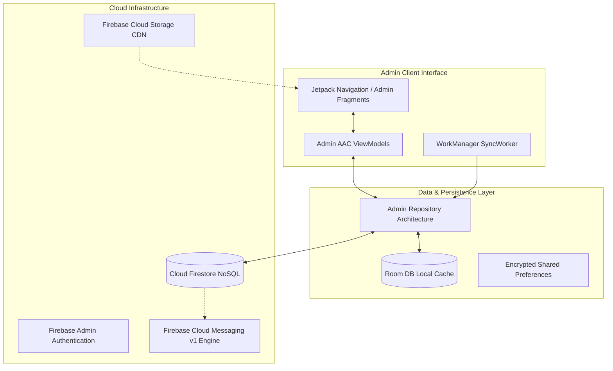
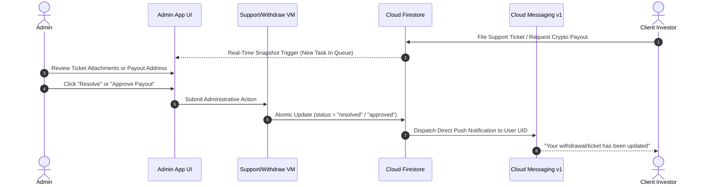

# BitBloom (Admin Control Panel)

[](https://developer.android.com)
[](https://kotlinlang.org/)
[](https://developer.android.com)
[](https://developer.android.com/topic/architecture)
[](https://firebase.google.com/docs/firestore)
[](LICENSE)

> Powerful Android administration and financial operations console for BitBloom, providing real-time liquidity tracking, crypto payout execution, support ticket triage, network leader analytics, and offline data caching via WorkManager.

---

## 📖 Overview

**BitBloom Admin** is the centralized management workstation engineered for BitBloom platform administrators, risk managers, and customer support representatives. Built with **Kotlin**, **MVVM architecture**, **Room DB caching**, and **AndroidX WorkManager**, the application communicates with **Cloud Firestore** in real time to process cryptocurrency withdrawals, publish investment products, review leadership hierarchies, and resolve user support inquiries.

### Operational Highlights
- **Executive Operations Cockpit**: Real-time aggregated metrics displaying total active deposits, registered investor counts, outstanding platform liabilities, and pending transactions.
- **Crypto Withdrawal Moderation**: Verify recipient blockchain wallet addresses, inspect account transaction history, and disburse payouts with automatic FCM push receipts.
- **Support Ticket Triage Desk**: Threaded customer issue management enabling administrators to inspect user-uploaded screenshots, reply directly, and update ticket lifecycle states.
- **Top Network Leaders Inspector**: Dedicated volume leaderboard calculating downline affiliate performance, qualifying active leaders for automated monthly salary disbursements.
- **Dynamic Plan Creation**: Publish new investment tiers with custom yields, maturity terms, and bonus caps without needing app updates.

---

## 🏗️ Architecture & Operations Flow



### Support Ticket & Payout Moderation Lifecycle



---

## ✨ Core Features

### 1. 📊 Executive Dashboard & Analytics
- **Live System Vitality**: Instant counters for active capital, total payout liabilities, and registered member growth.
- **Time-Filtered Financial Reports**: Filter revenue and withdrawal performance across daily, weekly, monthly, or custom date ranges using `TimeFilter`.

### 2. 💸 Crypto Payout Approval Workflows
- **Queue Moderation**: Real-time approval feed for pending USDT (BEP20 / TRC20) withdrawal requests.
- **Fraud Prevention**: Cross-verify user balance against historical daily ROI logs and downline commission records before releasing funds.

### 3. 🎫 Support Ticket Help Desk
- **Threaded Issue Inspector**: View user-submitted tickets complete with issue descriptions and photo attachments rendered via Glide.
- **Status Lifecycle**: Toggle ticket states between `OPEN`, `IN_PROGRESS`, `RESOLVED`, and `CLOSED`.

### 4. 🏆 Network Top Leaders & Salary Auditing
- **Downline Volume Tracking**: Calculate cumulative team sales volume across 8 downstream levels for each affiliate leader.
- **Salary Verification**: Audit qualifying thresholds for leaders eligible for automated monthly stipend disbursements.

### 5. 🔄 Background Sync & Offline-First Resilience
- **Room DB Caching**: Offline inspection of user records and ticket histories powered by Android Jetpack Room.
- **WorkManager Sync Engine**: Scheduled background synchronization (`SyncWorker`) ensuring data stays fresh during intermittent connectivity.

---

## 📱 Key Screens & Navigation Map

| Screen / Destination | Implementation Class | Description |
|---|---|---|
| **Dashboard** | `DashboardFragment` | Executive KPIs, liquidity metrics, pending task alerts, quick action hubs. |
| **User Management** | `UsersFragment`, `UserProfileFragment` | User search, portfolio breakdown, balance adjustments, and investment history. |
| **Withdrawal Desk** | `WithdrawFragment` | Crypto withdrawal approval and rejection moderation feed. |
| **Plan Manager** | `PlanFragment`, `AddPlanFragment` | Create and configure dynamic investment packages and ROI terms. |
| **Announcements** | `AnnoucementFragment`, `AddPosterFragment` | System text broadcasts and promotional banner image uploads. |
| **Support Desk** | `SupportFragment`, `TicketListFragment`, `TicketDetailsFragment` | Multi-user ticket moderation, image attachment viewing, status updating. |
| **Top Leaders** | `TopLeadersFragment` | Affiliate turnover leaderboards and network leader volume analytics. |
| **Reports** | `ReportFragment` | Time-filtered financial reconciliation and activity summaries. |

---

## 🛠️ Technical Stack Matrix

| Layer | Technologies / Libraries |
|---|---|
| **Language & Tooling** | Kotlin 2.0, JDK 17/21, Gradle Version Catalogs, Android SDK 35 |
| **UI Framework** | Android Jetpack (ViewBinding, Fragments, Navigation Component, Material Design 3) |
| **Architecture** | MVVM, Repository Pattern, Observable LiveData / Coroutines |
| **Local Storage & Sync**| Android Jetpack Room DB (KSP compiler), AndroidX WorkManager |
| **Backend & Cloud** | Google Firebase (Auth, Cloud Firestore NoSQL, Cloud Storage, FCM v1, Analytics) |
| **Image & Media** | Glide 4.16, Lottie Animations, CircleImageView, Ultra Pull-To-Refresh |
| **Networking & Parsing**| OkHttp3, Gson, Volley, gRPC OkHttp |

---

## 🚀 Getting Started

### Prerequisites
- **Android Studio Ladybug (2024.2.1+)** or newer.
- **JDK 17** configured as Gradle JVM.
- **Android SDK Platform 35**.
- Firebase project with administrative Firestore security rules.

### Setup & Installation

1. **Clone the Repository**:
   ```bash
   git clone https://github.com/shayann07/BitBloom-Admin.git
   cd BitBloom-Admin
   ```

2. **Configure SDK Environment**:
   ```bash
   cp local.properties.example local.properties
   ```
   Provide your local Android SDK path in `local.properties`.

3. **Firebase Configuration**:
   Add your administrative `google-services.json` to the `app/` directory:
   ```text
   app/google-services.json
   ```

4. **Build and Assemble**:
   ```bash
   # Assemble Debug APK
   ./gradlew assembleDebug

   # Run Unit Tests
   ./gradlew testDebugUnitTest
   ```

---

## 📄 License

This project is open-source software licensed under the [MIT License](LICENSE) — Copyright (c) 2026 [shayann07](https://github.com/shayann07).

<!-- gitpulse:contribution index="1" timestamp="2026-09-02" -->
<!-- gitpulse:contribution index="2" timestamp="2026-09-02" -->
<!-- gitpulse:contribution index="3" timestamp="2026-09-02" -->
<!-- gitpulse:contribution index="4" timestamp="2026-09-02" -->
<!-- gitpulse:contribution index="5" timestamp="2026-09-02" -->
<!-- gitpulse:contribution index="6" timestamp="2026-09-02" -->
<!-- gitpulse:contribution index="7" timestamp="2026-09-02" -->
<!-- gitpulse:contribution index="8" timestamp="2026-09-02" -->
<!-- gitpulse:contribution index="9" timestamp="2026-09-06" -->
<!-- gitpulse:contribution index="10" timestamp="2026-09-06" -->
<!-- gitpulse:contribution index="11" timestamp="2026-09-06" -->
<!-- gitpulse:contribution index="12" timestamp="2026-09-06" -->
<!-- gitpulse:contribution index="13" timestamp="2026-09-06" -->
<!-- gitpulse:contribution index="14" timestamp="2026-09-06" -->
<!-- gitpulse:contribution index="15" timestamp="2026-09-06" -->
<!-- gitpulse:contribution index="16" timestamp="2026-09-06" -->
<!-- gitpulse:contribution index="17" timestamp="2026-09-06" -->
<!-- gitpulse:contribution index="18" timestamp="2026-09-06" -->
<!-- gitpulse:contribution index="19" timestamp="2026-09-06" -->
<!-- gitpulse:contribution index="20" timestamp="2026-09-06" -->
<!-- gitpulse:contribution index="21" timestamp="2026-09-06" -->
<!-- gitpulse:contribution index="22" timestamp="2026-09-06" -->
<!-- gitpulse:contribution index="23" timestamp="2026-09-06" -->
<!-- gitpulse:contribution index="24" timestamp="2026-09-06" -->
<!-- gitpulse:contribution index="25" timestamp="2026-09-06" -->
<!-- gitpulse:contribution index="26" timestamp="2026-09-06" -->
<!-- gitpulse:contribution index="27" timestamp="2026-09-06" -->
<!-- gitpulse:contribution index="28" timestamp="2026-09-06" -->
<!-- gitpulse:contribution index="29" timestamp="2026-09-06" -->
<!-- gitpulse:contribution index="30" timestamp="2026-09-06" -->
<!-- gitpulse:contribution index="31" timestamp="2026-09-06" -->
<!-- gitpulse:contribution index="32" timestamp="2026-09-06" -->
<!-- gitpulse:contribution index="33" timestamp="2026-09-06" -->
<!-- gitpulse:contribution index="34" timestamp="2026-09-06" -->
<!-- gitpulse:contribution index="35" timestamp="2026-09-06" -->
<!-- gitpulse:contribution index="36" timestamp="2026-09-06" -->
<!-- gitpulse:contribution index="37" timestamp="2026-09-06" -->